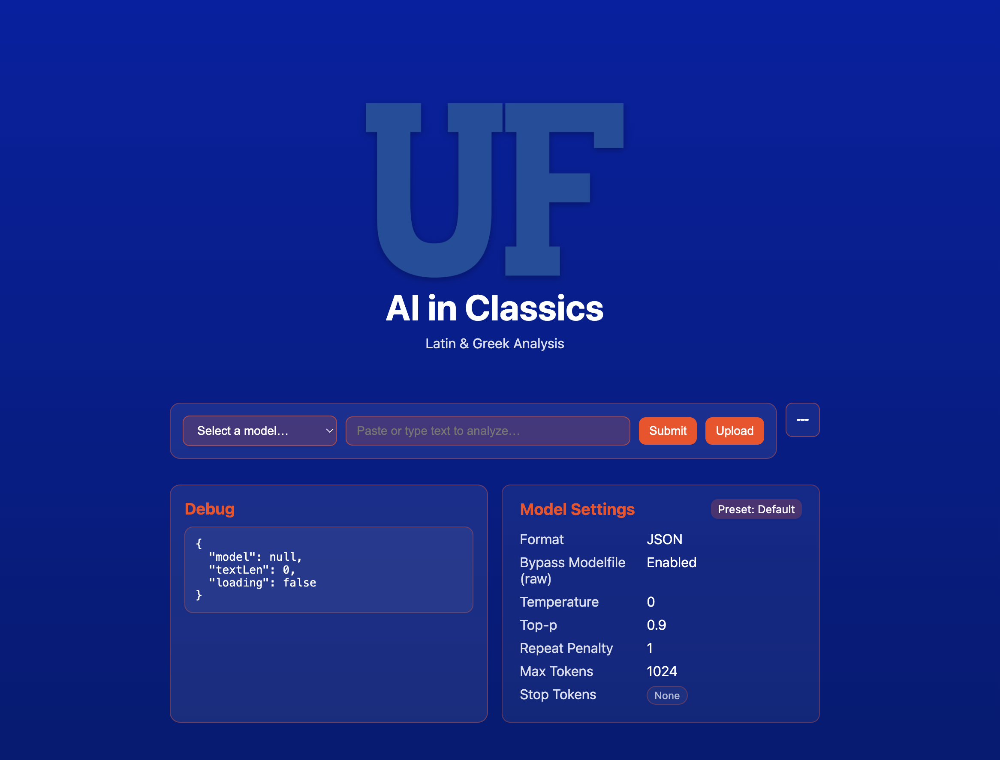
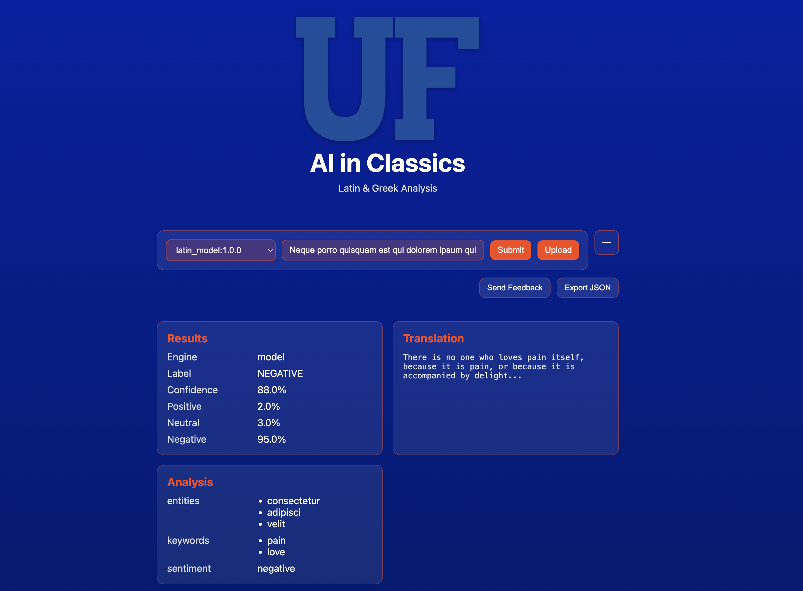
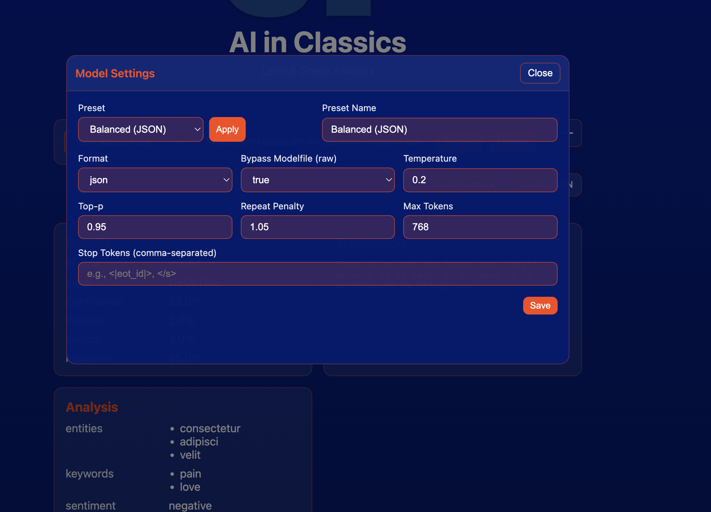
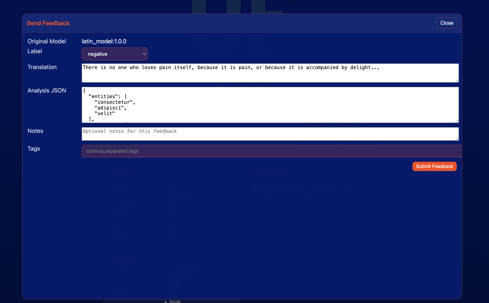
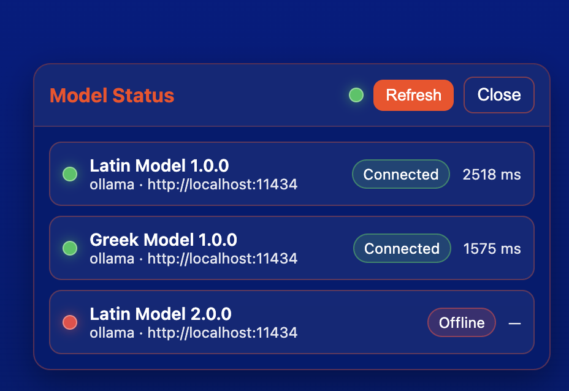
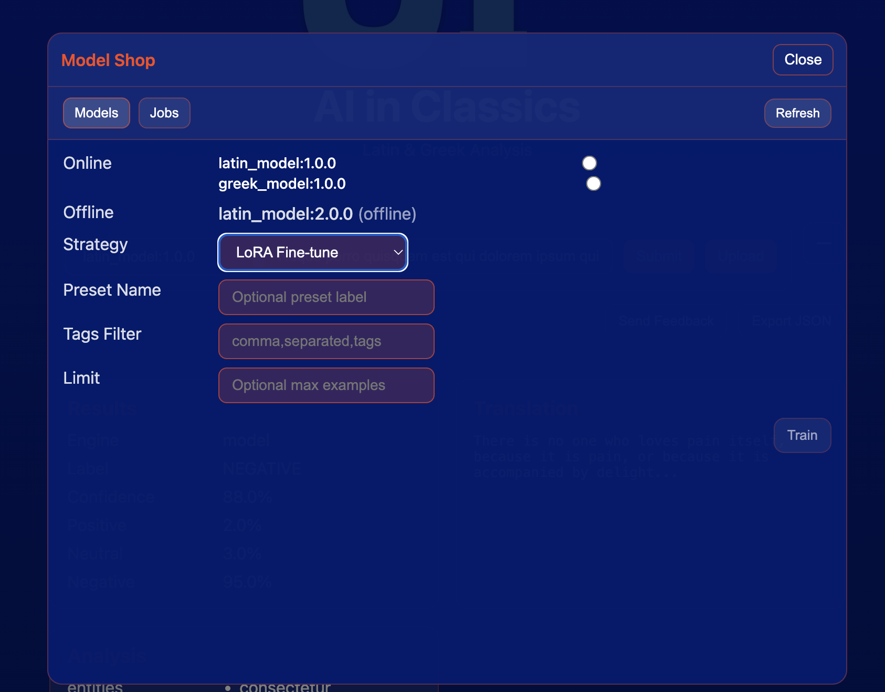

# AI in Classics

This project looks at various languages and runs anlysis on the scripture using various methods of Artifical Intellgiance,.

## ✨Check out our New UI✨

  
   
 Landing page 

  
 
 Latin model queried. 

## Current Features

- Search Functionality
- Notebook Integration for running juypter notebooks
- Chat features
- Switch between various LLM's

## New Features

### Adjust Model Parameters
Store and load preset parameters for a model.

  

### Submit feedback to improve the models

Submit feedback for each query to help improve the models.

  

### Check the status of a model or all models.

Check the status of local models and future cloud connected models.

  

## Future Improvements

Model Shop takes the stored feedback for a specific model and sends that data as tasks to improve the existing model.
Users can choose one of the three available training strategies and view the status of their job in the queue.

  

## Contributing

Contributions are welcome!

See `contributing.md` for ways to get started or click here [contribution](docs/contributing.md#contributing-to-the-project)

Please adhere to this project's `code of conduct`.

## Environment Variables

To run this project, you will need to add the following environment variables to your .env file

## Run Locally

to run this project locally See `dev.md` for setting up your workspace or click here [setup](docs/dev.md#setting-up-local-development)

## Acknowledgements

## Authors

- Alex John [@alxxjohn](https://www.github.com/alxxjohn)
- Byron Boatright [@bboatright01](https://github.com/bboatright01)
- Ryan Wilsom [@wilsonr8](https://github.com/willsonr8)
- Duncan Fuller [@df-ufgit](https://github.com/df-ufgit)
- Jake Morotta [@j-marotta](https://github.com/j-marotta)
